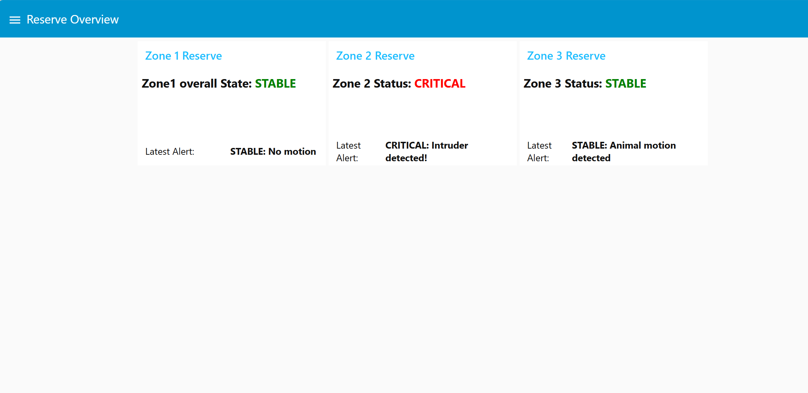
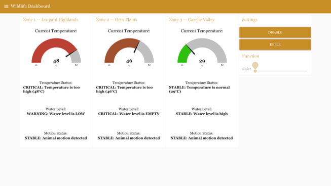
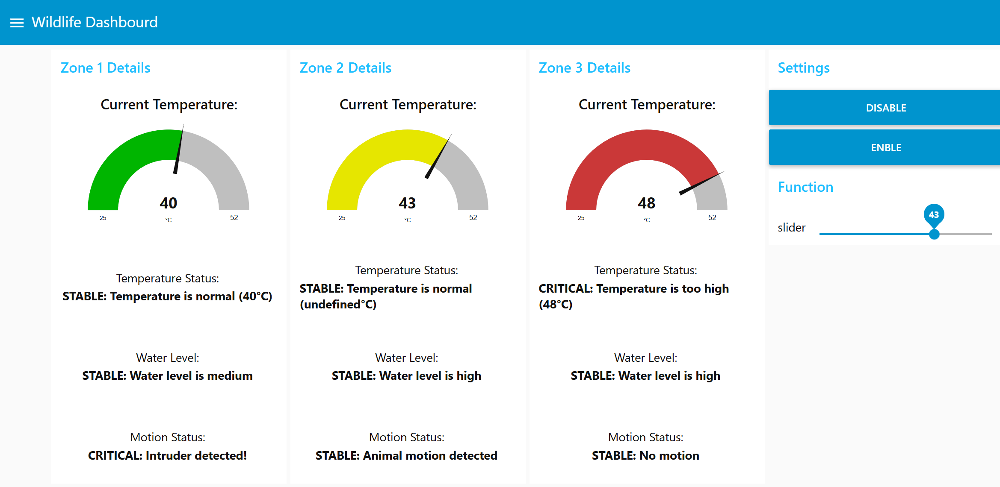
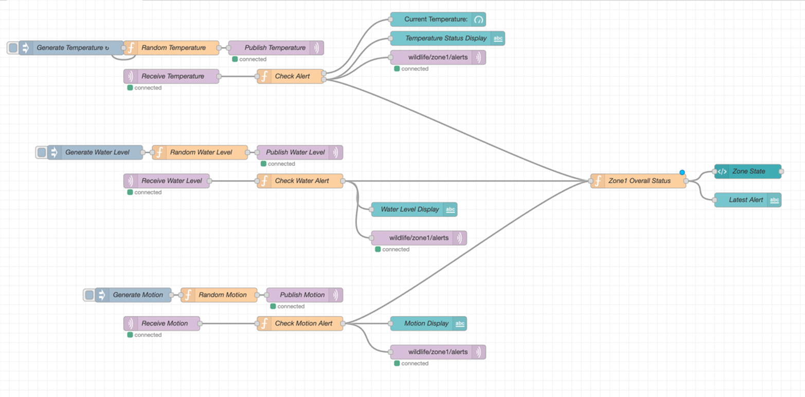
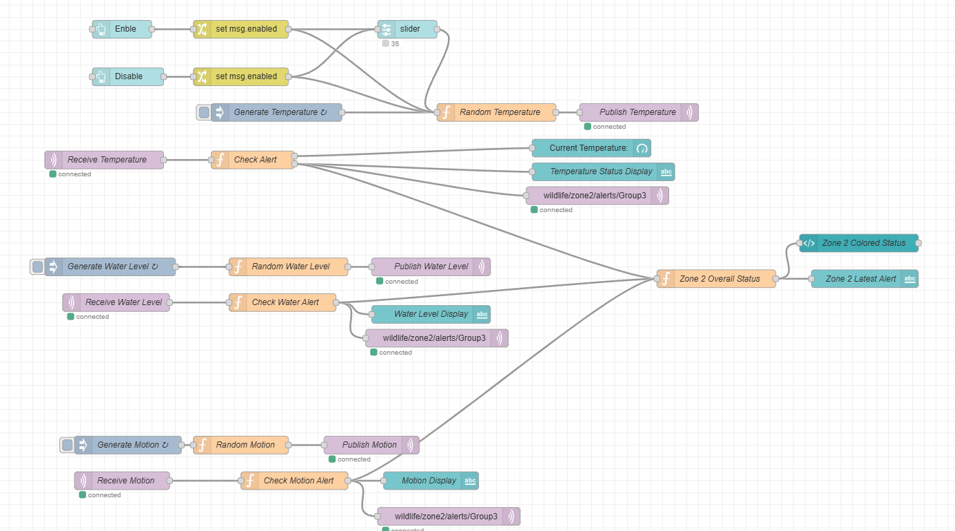
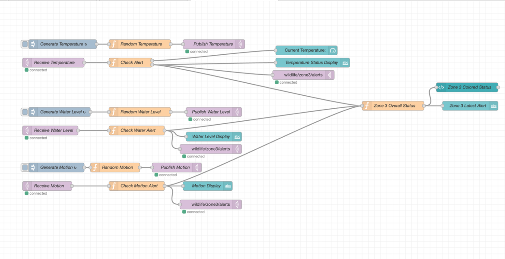

# Smart Wildlife Habitat Monitoring System

A simulated IoT-based wildlife habitat monitoring system developed using Node-RED and MQTT. The system monitors environmental conditions across multiple wildlife zones and generates real-time alerts when abnormal situations are detected.

## Project Overview

This project was developed as part of an Internet of Things (IoT) course. The system simulates sensor data and monitors wildlife habitats through a real-time dashboard.

The goal is to help wildlife reserve managers monitor environmental conditions and respond quickly to potential risks affecting protected species.

## Features

* Real-time monitoring of multiple wildlife zones
* Temperature monitoring
* Water level monitoring
* Motion detection monitoring
* Automatic alert generation
* MQTT-based communication
* Interactive Node-RED dashboard
* Color-coded status indicators:

  * Green = Stable
  * Amber = Warning
  * Red = Critical

## Monitored Zones

### Zone 1 – Leopard Highlands

Monitoring habitat conditions for the Arabian Leopard.

### Zone 2 – Oryx Plains

Monitoring habitat conditions for the Arabian Oryx.

### Zone 3 – Gazelle Valley

Monitoring habitat conditions for the Arabian Gazelle.

## System Architecture

The system follows the workflow below:

Sensor Simulation → MQTT Publisher → MQTT Broker → MQTT Subscriber → Data Processing → Dashboard Visualization → Alert Generation

## Simulated Sensors

### Temperature Sensor

* Range: 25°C – 52°C
* Warning Threshold: > 42°C
* Critical Threshold: > 45°C

### Water Level Sensor

Values:

* High
* Medium
* Low
* Empty

Thresholds:

* Warning: Low
* Critical: Empty

### Motion Sensor

Values:

* No Motion
* Animal Detected
* Intruder Detected

Critical Alert:

* Intruder Detection

## Technologies Used

* Node-RED
* MQTT
* EMQX Public Broker
* JavaScript (Function Nodes)
* Node-RED Dashboard

## Dashboard

The dashboard includes:

### Reserve Overview

* Zone status indicators
* Active alerts display

### Zone Details

* Temperature gauge
* Water level display
* Motion status indicator
* Alert message panel

## Project Structure

```text
flows.json
README.md
Screenshots/
```
## Screenshots

### Reserve Overview


### Wildlife Dashboard


### Zone 2 Manual Test


### Zone 1 Architecture


### Zone 2 Architecture


### Zone 3 Architecture


## Setup Instructions

1. Install Node-RED.
2. Import the provided `flows.json` file.
3. Configure the MQTT broker settings.
4. Deploy the flow.
5. Open the Node-RED dashboard.
6. Monitor the simulated wildlife zones.

## Future Improvements

* Integration with real IoT sensors
* SMS and email notifications
* Historical data storage
* Machine learning-based anomaly detection
* Mobile monitoring application
